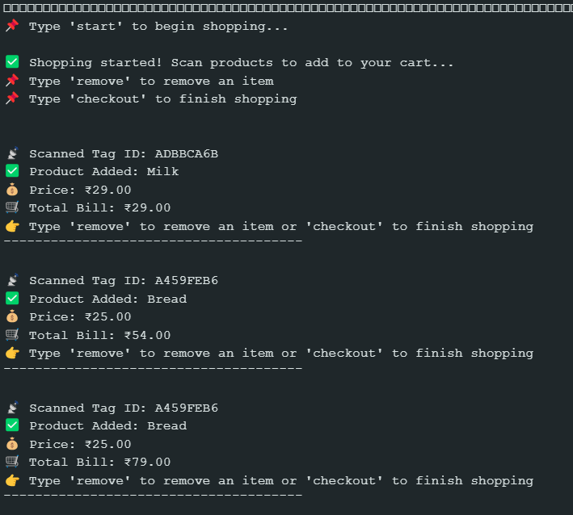

# Contributers
- Pranav Karwa
- Nabhya Sharma
- Hitesh Sangra
https://drive.google.com/file/d/1izHWyFMZtGgC17j_Y_u34W7ocuLdTTcV/view

# 🛒 Patented Smart Shopping Cart using RFID and Arduino UNO

This project demonstrates a **Smart Shopping Cart System** using **RFID technology** and an **Arduino UNO** to automate billing in retail settings. Customers scan RFID-tagged items, monitor their bill in real time, and complete checkout — all without needing a traditional cashier.

---

## 🚀 Features

- RFID-based real-time product scanning
- Dynamic billing system via Serial Monitor
- Add/remove products during shopping
- Simple typing interface (`start`, `remove`, `checkout`)
- Low-cost and standalone (no internet required)

---

## 🧰 Hardware Used

- Arduino UNO
- MFRC522 RFID Reader
- RFID Tags
- Jumper Wires
- Serial Monitor (via Arduino IDE)

---

## 🔌 Hardware Connections

| RC522 Pin | Arduino UNO Pin | Description         |
|-----------|------------------|---------------------|
| SDA (SS)  | 10               | Slave Select        |
| SCK       | 13               | SPI Clock           |
| MOSI      | 11               | SPI Master Out      |
| MISO      | 12               | SPI Master In       |
| RST       | 9                | Reset               |
| GND       | GND              | Ground              |
| 3.3V      | 3.3V             | Power Supply        |

### 🖼️ Circuit Connection (Real-time Setup)
 


---
## Results



## 📦 Product and Tag Example

```cpp
Product products[] = {
    {"Milk", 29},
    {"Bread", 25},
    {"Rice", 32},
    {"Cookie", 35}
};

String productIDs[] = {
    "ADBBCA6B", "A459FEB6", "D4BC09B0", "43965A29"
}; 
